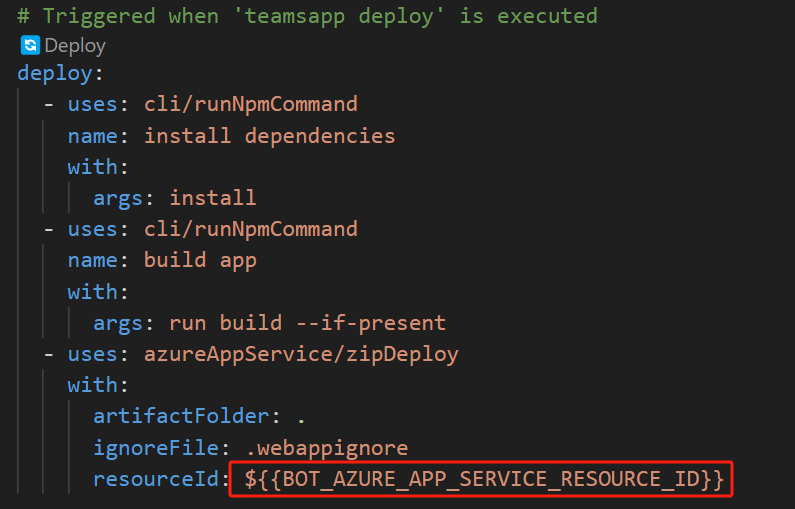
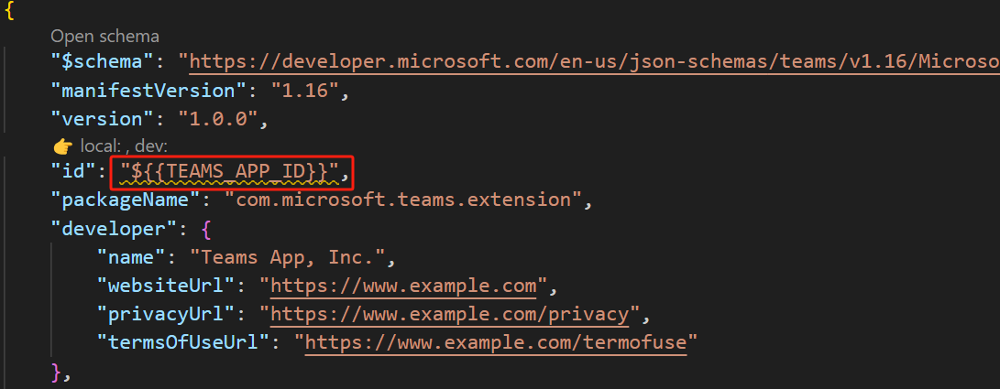
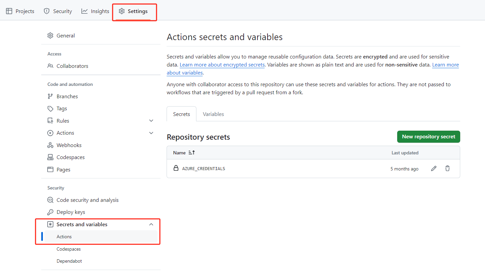
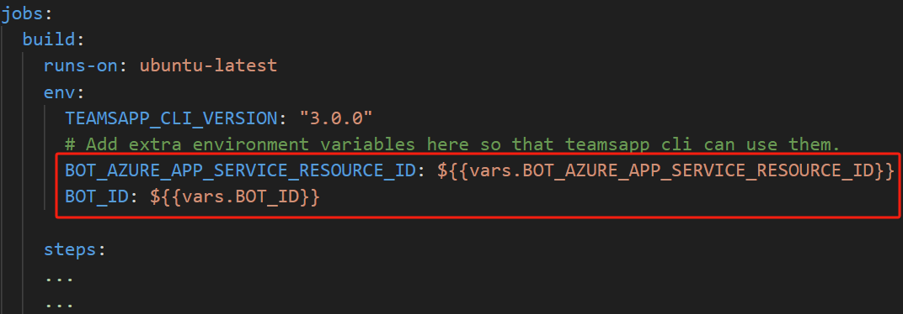
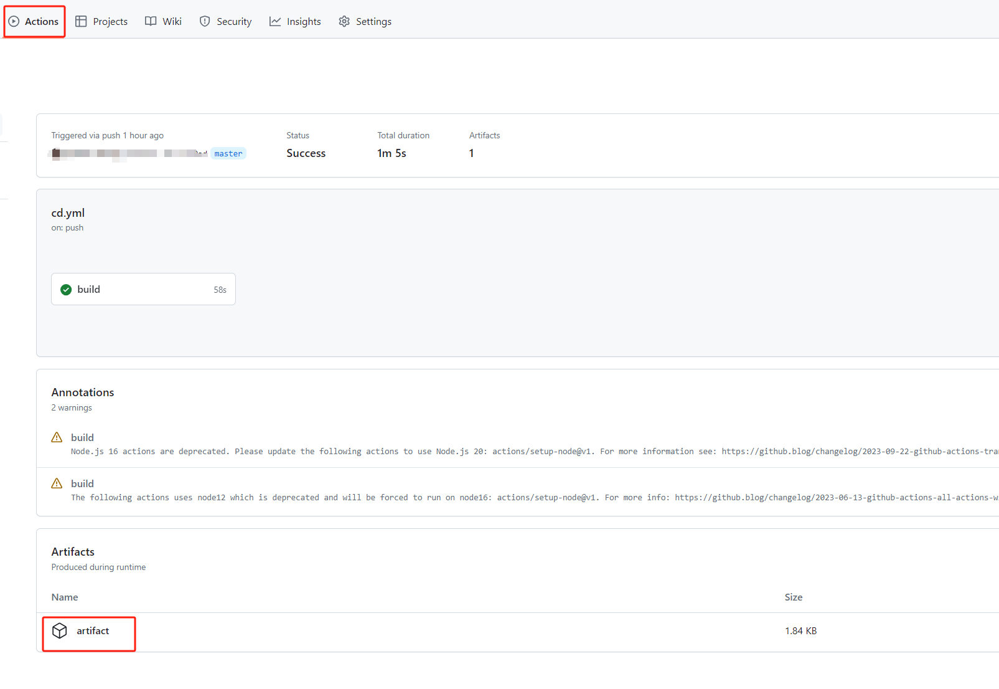
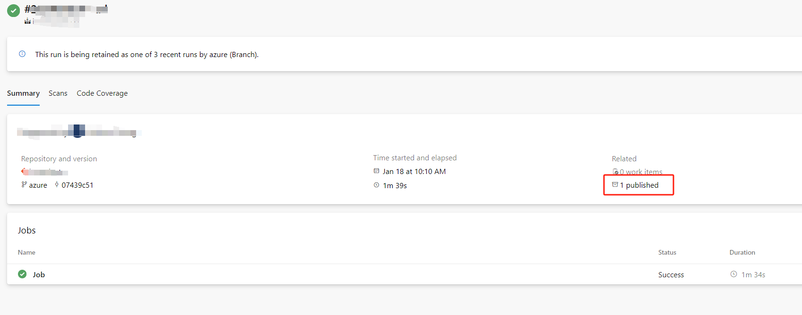

# Set up CI/CD pipelines

You can set up a Continuous Integration and Continuous Deployment (CI/CD) pipeline for Microsoft Teams apps created with the Teams Toolkit. A Teams app CI/CD pipeline typically consists of three parts: 
1. Building the project.
1. Deploying the project to cloud resources.
1. Generating the Teams app package.

> Before creating a pipeline for a Teams app, it is essential to prepare the necessary cloud resources, such as Azure Web App, Azure Functions, or Azure Static Web App, and configure the app settings. 

Building the project involves compiling the source code and creating the necessary artifacts for deployment. For the deployment process, it is recommended to use the Teams Toolkit CLI. For more information, please refer to [Set up CI/CD pipelines with Teams Toolkit CLI](#set-up-cicd-pipelines-with-teams-toolkit-cli). If you prefer not to use the Teams Toolkit CLI for deployment or would like to customize your pipeline, you can refer to [Set up CI/CD pipelines using your own workflow](#set-up-cicd-pipelines-using-your-own-workflow). The final step, generating the Teams app package, helps you test your Teams app after deployment by [Upload your app in Teams](https://learn.microsoft.com/en-us/microsoftteams/platform/concepts/deploy-and-publish/apps-upload). 

## Set up CI/CD pipelines with Teams Toolkit CLI
You can use [Teams Toolkit CLI](https://learn.microsoft.com/en-us/microsoftteams/platform/toolkit/teams-toolkit-cli?pivots=version-three) to automate the following procedures:
1.	Building and deploying code to Azure.
2.	Generating a Teams app's appPackage, which can be used for [app distribution](https://learn.microsoft.com/en-us/microsoftteams/platform/concepts/deploy-and-publish/apps-publish-overview).

> For creating project, we recommend using Teams Toolkit version 5.6.0 or later.
 
### Prerequisites

> If you already ran Teams Toolkit’s “**provision**” command, you can skip prerequisites 1 and 2.
    
1.	Prepare Teams app needed resources.

    You can manually prepare the resources (teams app id, bot id, etc) by looking into manifest file under appPackage/ folder, or you can run Teams Toolkit’s “**provision**” command to create them automatically.
2.	Prepare and config Azure resources.

    You can manually prepare these resources by looking into biceps files under infra/ folder, , or you can run Teams Toolkit’s “**provision**” command to prepare these Azure resources automatically.

3.	Prepare service principal.

    You should have a service principal and configure its access policies on resources. Below are some docs that you can refer to:
    -	[Create service principal using Azure portal](https://learn.microsoft.com/en-us/entra/identity-platform/howto-create-service-principal-portal)
    -	[Create service principal using Azure CLI](https://learn.microsoft.com/en-us/cli/azure/azure-cli-sp-tutorial-1?tabs=bash#create-a-service-principal-with-role-and-scope)
    
    Teamsapp cli currently supports login to Azure using service principal secret. [Create a secret](https://learn.microsoft.com/en-us/entra/identity-platform/howto-create-service-principal-portal#option-3-create-a-new-client-secret) and save service principal’s **client id**, **client secret**, **tenant id** for following steps.

4. Prepare a GitHub/Azure repository.

After you meet the above prerequisites, you can follow the steps below to setup the pipeline. This document provides tutorial for [GitHub](#set-up-pipeline-with-github) and [Azure DevOps](#set-up-pipeline-with-azure-devops), if you wish to use other platforms, you can also refer to this document for guidance.
### Set up pipeline with GitHub

#### 1. Create a CD yml in your project
Create a cd.yml file under .github/workflows/ folder.  Write the following content into this yml file.
```yml
on:
  push:
    branches:
      - master
jobs:
  build:
    runs-on: ubuntu-latest
    env:
      TEAMSAPP_CLI_VERSION: "3.0.0"
      # Add extra environment variables here so that teamsapp cli can use them.

    steps:
      - name: "Checkout Github Action"
        uses: actions/checkout@master

      - name: Setup Node 20.x
        uses: actions/setup-node@v1
        with:
          node-version: "20.x"

      - name: install cli
        run: |
          npm install @microsoft/teamsapp-cli@${{env.TEAMSAPP_CLI_VERSION}}

      - name: Login Azure by service principal
        run: |
          npx teamsapp account login azure --username ${{vars.AZURE_SERVICE_PRINCIPAL_CLIENT_ID}}  \
          --service-principal true \
          --tenant ${{vars.AZURE_TENANT_ID}} \
          --password ${{secrets.AZURE_SERVICE_PRINCIPAL_CLIENT_SECRET }} \
          --interactive false

      - name: Deploy to hosting environment
        run: |
          npx teamsapp deploy --ignore-env-file true \
          --interactive false

      - name: Package app
        run: |
          npx teamsapp package

      - name: upload appPackage
        uses: actions/upload-artifact@v4
        with:
          name: artifact
          path: appPackage/build/appPackage.zip
```
>The default pipeline will be triggered when push events happen on master branch, you can modify it to meet your own needs. 

#### 2. Set variables/secrets in the repository
The following variables and secrets are needed for the pipeline:
- AZURE_SERVICE_PRINCIPAL_CLIENT_ID, AZURE_TENANT_ID, AZURE_SERVICE_PRINCIPAL_CLIENT_SECRET.
- Go to `teamsapp.yml` file, in `deploy` stage, the placeholders wrapped in \${{}} are the needed variables' keys. 
If you used Teams Toolkit's "**provision**" command, you can find the values in /env files.

  Below is an example of `teamsapp.yml`, the "BOT_AZURE_APP_SERVICE_RESOURCE_ID" needs to be set in the repo variable.
  
- Go to `appPackage/manifest.json` file, the placeholders wrapped in \${{}} are the needed variables' keys. If you used Teams Toolkit's "**provision**" command, you can find the values in /env files.

  Below is an example of `manifest.json` snippet, the "TEAMS_APP_ID" needs to be set in the repo variable.
  

Therefore for the above example, you need to set the following variables in the repo.

  | key name                                          | 
  |---------------------------------------------------|
  | AZURE_SERVICE_PRINCIPAL_CLIENT_ID                 | 
  | AZURE_TENANT_ID                                   | 
  | AZURE_SERVICE_PRINCIPAL_CLIENT_SECRET             | 
  | BOT_AZURE_APP_SERVICE_RESOURCE_ID | 
  | TEAMS_APP_ID                 | 

You can set variables/secrets in repo's "Settings"->"Secrets and variables"->"Actions"

> The  AZURE_SERVICE_PRINCIPAL_CLIENT_SECRET should be set as secret.


The variables wrapped in ${{}} in teamsapp.yml and appPackage/manifest.json need to be explicitly added to env so that teamsapp cli can read them.

Taking above as an example, you need to modify your pipeline's yml file as:


#### 4. Run the pipeline
Push code to the repo to trigger pipeline. 
> You don't need to commit env files under env/ folder into the repo. The env needed for running CI/CD pipeline are already set in the repo variables.

The default pipeline will be triggered when push events happen on master branch, you can modify it to meet your own needs. After the pipeline runs successfully you should see from the log that code has been deployed to Azure and the appPackage has been generated in artifacts.


### Set up pipeline with Azure DevOps
#### 1. Create a CD yml in your project
Create a yml file under your project. Write the following content into this yml file.
```yml
trigger:
  - master

pool:
  vmImage: ubuntu-latest

variables:
  TEAMSAPP_CLI_VERSION: 3.0.0

steps:
  - task: NodeTool@0
    inputs:
      versionSpec: "20"
      checkLatest: true

  - script: |
      npm install @microsoft/teamsapp-cli@$(TEAMSAPP_CLI_VERSION)
    displayName: "Install CLI"

  - script: |
      npx teamsapp account login azure --username $(AZURE_SERVICE_PRINCIPAL_CLIENT_ID) --service-principal true --tenant $(AZURE_TENANT_ID) --password $(AZURE_SERVICE_PRINCIPAL_CLIENT_SECRET) --interactive false
    displayName: "Login Azure by service principal"

  - script: |
      npx teamsapp deploy --ignore-env-file true --interactive false
    displayName: "Deploy to Azure"

  - script: |
      npx teamsapp package
    displayName: "Package app"

  - publish: $(System.DefaultWorkingDirectory)/appPackage/build/appPackage.zip
    artifact: artifact
```
>The default pipeline will be triggered when push events happen on master branch, you can modify it to meet your own needs. 

#### 2. Setup Azure pipeline
After pushing your code to repo. Go to **Pipelines**, and then select **New pipeline**. Select your repo and select your existing yml file to configure your pipeline.

#### 3. Set variables/secrets in pipeline 
The following variables and secrets are needed for the pipeline:
- AZURE_SERVICE_PRINCIPAL_CLIENT_ID, AZURE_TENANT_ID, AZURE_SERVICE_PRINCIPAL_CLIENT_SECRET.
- Go to `teamsapp.yml` file, in `deploy` stage, the placeholders wrapped in \${{}} are the needed variables' keys. 
If you used Teams Toolkit's "**provision**" command, you can find the values in /env files.

  Below is an example of `teamsapp.yml`, the "BOT_AZURE_APP_SERVICE_RESOURCE_ID" needs to be set in the repo variable.
  
- Go to `appPackage/manifest.json` file, the placeholders wrapped in \${{}} are the needed variables' keys. If you used Teams Toolkit's "**provision**" command, you can find the values in /env files. 

  Below is an example of `manifest.json` snippet, the "TEAMS_APP_ID" needs to be set in the repo variable.
  
  > If you used Teams Toolkit's "**provision**" command to create Azure resources and Teams app resources, you can find the values of these variables in your project's /env files.

Therefore for the above example, you need to set the following variables in the pipeline.

  | key name                                          | 
  |---------------------------------------------------|
  | AZURE_SERVICE_PRINCIPAL_CLIENT_ID                 | 
  | AZURE_TENANT_ID                                   | 
  | AZURE_SERVICE_PRINCIPAL_CLIENT_SECRET             | 
  | BOT_AZURE_APP_SERVICE_RESOURCE_ID | 
  | TEAMS_APP_ID                 | 

For setting variables in your pipeline, go to your pipeline and click **Edit**-> **Variables**.
#### 4. Run the pipeline
Push code to the repo to trigger pipeline. 
> You don't need to commit env files under env/ folder into the repo. The env needed for running CI/CD pipeline are already set in the pipeline variables.

After the pipeline runs successfully you should see from the log that code deployed to Azure and the appPackage has been generated in artifacts. 



## Set up CI/CD pipelines using your own workflow

If you're unable to leverage the Teams App CLI within your pipeline, you can create a custom deployment process tailored to your needs. This document offers guidance on how to deploy to Azure using custom methods. If you are using a different cloud platform, you can also refer to this document for guidance.

> If you already have a complete CI/CD pipeline in place for deploying to your Azure resource, your Teams app requires reading environment variables during runtime, you need to configure these environment variables in your Azure resource's settings. You can refer directly to [Generate app package](#generate-the-apppackage-for-the-teams-app) section for testing after deployment. 

The `teamsapp deploy` command executes the actions in teamsapp.yml's "deploy" stage. Most of the "deploy" stages consist of "build" and "deploy" actions. To create a custom deployment method, you need to rewrite these actions according to your requirements and preferences.

Taking basic bot typescript project as an example, its teamsapp.yml's deploy stage is as following:
```yml
deploy:
  # Run npm command
  - uses: cli/runNpmCommand
    name: install dependencies
    with:
      args: install
  - uses: cli/runNpmCommand
    name: build app
    with:
      args: run build --if-present
  # Deploy your application to Azure App Service using the zip deploy feature.
  # For additional details, refer to https://aka.ms/zip-deploy-to-app-services.
  - uses: azureAppService/zipDeploy
    with:
      # Deploy base folder
      artifactFolder: .
      # Ignore file location, leave blank will ignore nothing
      ignoreFile: .webappignore
      # The resource id of the cloud resource to be deployed to.
      # This key will be generated by arm/deploy action automatically.
      # You can replace it with your existing Azure Resource id
      # or add it to your environment variable file.
      resourceId: ${{BOT_AZURE_APP_SERVICE_RESOURCE_ID}}
```
These actions do the following things:
- run `npm install` and `npm build` to build the project.
- deploy code to Azure app service.

You can rewrite these actions in your CI/CD pipeline in your own way. 
Below is an example of using GitHub official actions:
```yml
    # build
    - name: Setup Node 20.x
      uses: actions/setup-node@v1
      with:
        node-version: '20.x'
    - name: 'npm install, build'
      run: |
        npm install
        npm run build --if-present

    - name: 'zip artifact for deployment'
      run: |
        zip -r deploy.zip . --include 'node_modules/*' 'lib/*' 'web.config'

    # deploy
    - name: 'Login via Azure CLI'
      uses: azure/login@v1
      with:
        client-id: ${{ vars.CLIENT_ID }}
        tenant-id: ${{ vars.TENANT_ID }}
        subscription-id: ${{ vars.SUBSCRIPTION_ID }}

    - name: 'Run Azure webapp deploy action using azure RBAC'
      uses: azure/webapps-deploy@v2
      with:
        app-name: ${{ vars.AZURE_WEBAPP_NAME }}
        package: deploy.zip
```

Currently, the Teams Toolkit supports Teams app projects written in different programming languages and suitable to be hosted on different Azure services. Below lists some official actions for build and deploy. You can refer to these actions when setting up CI/CD deployment pipelines.

Build:

| language      | GitHub                    |Azure Pipeline
|---------------------------------------------------|-------------------------------|----|
| JS/TS                | [actions/setup-node](https://github.com/actions/setup-node)  |[NodeTool@0](https://learn.microsoft.com/en-us/azure/devops/pipelines/tasks/reference/node-tool-v0?view=azure-pipelines) | 
| C#      | [actions/setup-dotnet](https://github.com/actions/setup-dotnet)  |[DotNetCoreCLI@2](https://learn.microsoft.com/en-us/azure/devops/pipelines/tasks/reference/dotnet-core-cli-v2?view=azure-pipelines)|


Deploy:

| resource   | GitHub                  |Azure Pipeline
|---------------------------------------------------|-------------------------------|----|
| Azure App Service               |[azure/webapps-deploy](https://github.com/Azure/webapps-deploy)| [AzureWebApp@1](https://learn.microsoft.com/en-us/azure/devops/pipelines/tasks/reference/azure-web-app-v1?view=azure-pipelines)
| Azure Functions     |[Azure/functions-action](https://github.com/Azure/functions-action)|[AzureFunctionApp@2](https://learn.microsoft.com/en-us/azure/devops/pipelines/tasks/reference/azure-function-app-v2?view=azure-pipelines)
|Azure Static Web Apps             |[Azure/static-web-apps-deploy](https://github.com/Azure/static-web-apps-deploy)| [AzureStaticWebApp@0](https://learn.microsoft.com/en-us/azure/devops/pipelines/tasks/reference/azure-static-web-app-v0?view=azure-pipelines)|

### Credential needed for login to Azure
If you are using CI/CD to deploy app code to Azure app service, Azure functions or Azure container app, you need a service principal to login to Azure. There are 2 ways of login to Azure using service principal: using **OpenID Connect(OIDC)** or **secret**.

Currently teamsapp CLI supports login using service principal with secret. If you want to use OIDC, for GitHub action please refer to [use Azure login action with OpenID Connect](https://learn.microsoft.com/en-us/azure/developer/github/connect-from-azure?tabs=azure-portal%2Cwindows#use-the-azure-login-action-with-openid-connect); for Azure pipeline please refer to [create a Azure resource manager service connection that uses workload identity federation](https://learn.microsoft.com/en-us/azure/devops/pipelines/library/connect-to-azure?view=azure-devops#create-an-azure-resource-manager-service-connection-that-uses-workload-identity-federation).

### Generate the appPackage for the teams app
You will need the `appPackage` to distribute your Teams app. Teamsapp CLI's command "teamsapp package" can help you create the `appPackage.zip` automatically. If you cannot leverage teamsapp CLI to do this, you can follow below steps to create the appPackage by hand.
1. prepare a `appPackage/` folder.

1. put `mainfest.json` in `appPackage` folder.

    The default `manifest.json` in Teams Toolkit project has placeholders (wrapped in ${{}}). You should replace these placeholders with true values.

2. put app icons in `appPackage` folder.
    
    Follow the guide to prepare [app icons](https://learn.microsoft.com/en-us/microsoftteams/platform/concepts/build-and-test/apps-package#app-icons). You should have 2 .png files as output.
3. zip the appPackage folder.
    Zip the `appPackage/` folder into `appPackage.zip`.


